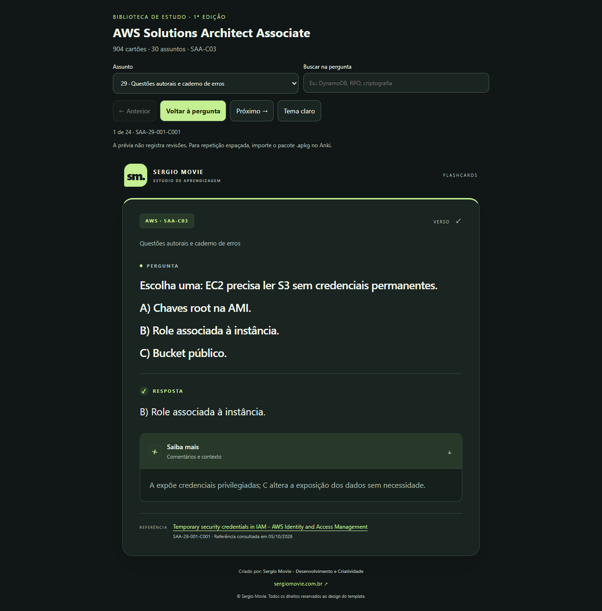

# AWS na cabeça. Um cartão de cada vez.

### 904 flashcards em português para avançar nos estudos da AWS SAA-C03.

**30 assuntos · Respostas comentadas · Referências técnicas · Pronto para o Anki**

Feito por **Sergio Movie** para quem acredita que conhecimento bom merece ser compartilhado.

[**Baixar o baralho completo**](baralhos/AWS-SAA-C03-Sergio-Movie.apkg?raw=true) · [Começar a estudar](COMECE-AQUI.md) · [Escolher um assunto](ASSUNTOS.md)

---

Você termina uma aula, entende o conceito… e, alguns dias depois, bate aquela dúvida: **“Quando eu usaria isso em uma arquitetura de verdade?”**

Foi para encarar esse momento que este projeto nasceu. Uma biblioteca de flashcards para você testar o que lembra, entender o raciocínio da resposta e voltar aos pontos que ainda precisam de atenção — do IAM ao desenho de arquiteturas resilientes.

São **904 cartões autorais de estudo**, organizados em **30 assuntos**, com perguntas diretas, respostas em português e um **Saiba mais** para aprofundar o contexto. Tudo em um layout pensado com cuidado para tornar a revisão agradável.

**Para os meus irmãos de jornada na tecnologia: o material está aqui para somar na sua preparação. Baixe, estude no seu ritmo e compartilhe com quem está caminhando junto. Bora pra cima!** 🚀

## Olha como ficou

A imagem mostra a prévia no navegador. O pacote Anki utiliza o mesmo template de cartão. Para experimentar os 904 cartões sem importar, baixe o repositório e abra [previa/index.html](previa/index.html) no navegador. A prévia não registra revisões.

## O que você encontra aqui

| Recurso | Para o seu estudo |
| --- | --- |
| **904 cartões em PT-BR** | Perguntas de conceitos, comparações, diagnóstico e cenários |
| **30 assuntos separados** | Escolha o tema que você precisa revisar agora |
| **Resposta + Saiba mais** | Confira a resposta e explore a explicação complementar |
| **Referências por cartão** | Volte à documentação para aprofundar o tema |
| **Pacote pronto para Anki** | Importe e use os recursos de revisão do aplicativo |
| **Conteúdo consultável** | Leia os cartões por assunto diretamente no GitHub |
| **Visual Sergio Movie** | Layout responsivo, logo opcional e comentários expansíveis |

## Comece em poucos passos

1. Baixe o [pacote completo `.apkg`](baralhos/AWS-SAA-C03-Sergio-Movie.apkg?raw=true). Se o GitHub mostrar a página do arquivo, use o botão de download do arquivo bruto.
2. No Anki, escolha **Arquivo → Importar** e selecione o arquivo.
3. Abra **AWS SAA-C03 · Sergio Movie**, escolha um assunto e comece.

Para conferir o visual antes de estudar: **Navegar → selecione um cartão → Pré-visualizar**. Os nomes dos controles podem variar conforme o idioma e a versão.

O [guia rápido](COMECE-AQUI.md) explica importação, prévia, atualizações e edição. O `.apkg` inclui notas, cartões e tipo de nota, conforme o [manual do Anki](https://docs.ankiweb.net/importing/packaged-decks.html).

## O que vamos revisar?

Fundamentos de cloud, IAM, EC2, Auto Scaling, S3, VPC, bancos de dados, DynamoDB, Route 53, CloudFront, mensageria, containers, serverless, dados, IA/ML, observabilidade, migração, recuperação de desastres, governança, custos, criptografia e cenários integrados.

Veja a [lista completa dos 30 assuntos](ASSUNTOS.md), com a quantidade de cartões e o download individual de cada baralho.

## Estude com intenção

Leia a pergunta e tente responder antes de virar. Confira a explicação, investigue o que ficou confuso e use as revisões do Anki para retomar esses pontos. Combine os cartões com documentação, prática e exercícios. A quantidade de novos cartões por dia deve caber na sua rotina.

Esta primeira edição oferece cobertura inicial dos **436 objetivos do roteiro próprio do projeto**. Isso não significa cobertura exaustiva do exame nem garantia de aprovação. É um material independente, sem vínculo oficial com a AWS e sem alegação de reproduzir questões reais da prova. Conteúdo de referência consultado em **05/10/2026**.

## Vamos melhorar juntos

Encontrou uma resposta imprecisa ou uma referência que mudou? Abra uma issue com o **ID do cartão**, a correção sugerida e a documentação que sustenta o ajuste. Veja [como contribuir](CONTRIBUTING.md).

Se o material te ajudou, deixe uma ⭐ e compartilhe o repositório com outro irmão de estudos. Sua contribuição pode ajudar alguém a destravar o próximo assunto.

## Autoria e créditos

**Sergio Movie — Desenvolvimento e Criatividade**  
[sergiomovie.com.br](https://sergiomovie.com.br)

Organização temática baseada no trabalho de **Thiago Cardoso / Thiago-code-lab**, com atribuição e licença preservadas. Consulte [CREDITOS.md](CREDITOS.md) para a origem, as referências e os direitos do design.

**Pare. Pense. Lembre. E siga construindo seu próximo passo na AWS.**
